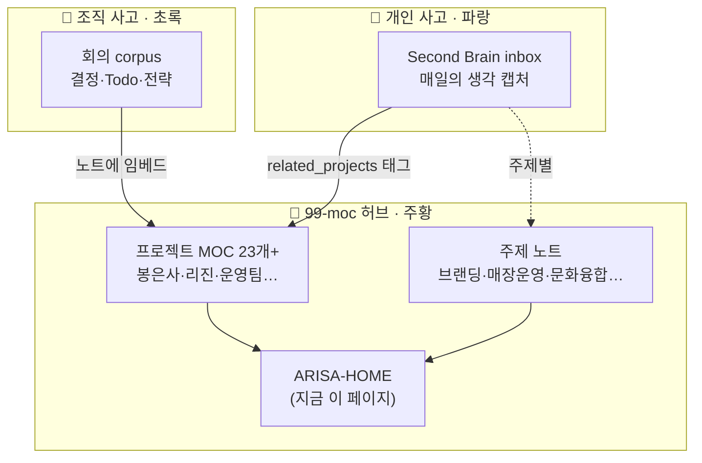

# 🧭 ARISA — 사고 그래프 홈

> [!map] 이 페이지는 무엇인가요?
> **흩어진 생각과 회의 기록을 "프로젝트"라는 자석으로 끌어모아 한눈에 보는 지도**입니다.
> 매일 텔레그램으로 쌓은 **개인 생각**과, 회의에서 정리된 **조직 결정**이 각 프로젝트 허브에서 만납니다.

## 🗺️ 한 장으로 보는 구조



> [!tip] 어떻게 쓰나요?
> 1. 아래 **프로젝트 허브** 표에서 보고 싶은 프로젝트를 클릭 → 그 프로젝트의 조직 결정 + 개인 생각이 한 노트에 모여 있습니다.
> 2. **다음 액션** 표로 "지금 뭘 해야 하지?"를 한눈에 점검.
> 3. 상단 우측 **그래프 아이콘**(또는 `Cmd+G`)으로 별자리 형태의 연결망을 봅니다 — 파랑=개인, 초록=조직, 주황=허브.

---

## 📂 프로젝트 허브 — 클릭해서 들어가기

> [!note] 각 프로젝트의 "통합 페이지" 목록입니다. **조직 corpus** 칸에 폴더명이 있으면 그 프로젝트는 회의 기록까지 연결돼 있습니다.

```dataview
TABLE WITHOUT ID file.link AS "프로젝트", org_folder AS "🏢 조직 corpus", join(aliases, ", ") AS "별칭"
FROM "99-moc/projects"
WHERE moc = "project"
SORT org_folder DESC, file.name ASC
```

## 📊 어디에 생각이 몰려 있나 — 프로젝트별 활동량

> [!note] 개인 inbox에서 각 프로젝트에 연결된 생각의 수. **숫자가 클수록 요즘 머릿속을 많이 차지하는 프로젝트**입니다.

```dataview
TABLE WITHOUT ID proj AS "프로젝트", length(rows) AS "💭 연결된 생각 수"
FROM "20-operations/24-second-brain/00_inbox"
FLATTEN related_projects AS proj
GROUP BY proj
SORT length(rows) DESC
```

## ⚡ 지금 뭘 해야 하나 — 전역 다음 액션

> [!todo] 캡처 때 "다음 행동(next_action)"이 적힌 생각만 모았습니다. **흘려보낸 할 일을 다시 건져 올리는 그물**입니다.

```dataview
TABLE WITHOUT ID file.link AS "원문", related_projects AS "프로젝트", next_action AS "✅ 다음 행동", created AS "캡처일"
FROM "20-operations/24-second-brain/00_inbox"
WHERE next_action AND next_action != ""
SORT created DESC
LIMIT 40
```

---

## 🧭 더 둘러보기

> [!abstract] 다른 진입점
> - 🏷️ **[[_topics-home|주제로 보기]]** — 프로젝트를 가로지르는 생각 (브랜딩·매장운영·문화융합 등)
> - 🪺 **[[inbox-triage|고립 노트 점검]]** — 어떤 프로젝트·주제에도 안 걸린 캡처 정리
> - 🏢 회의 corpus 직접 보기 → 좌측 탐색기 `20-operations/23-arisa/org-memory/`

*이 페이지는 자동 생성기가 덮어쓰지 않습니다 — 자유롭게 다듬으세요.*
